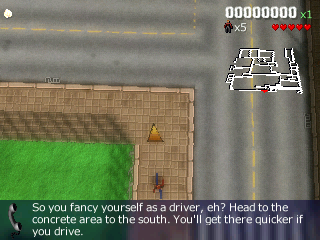
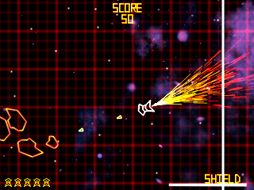
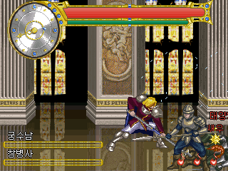
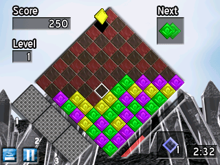
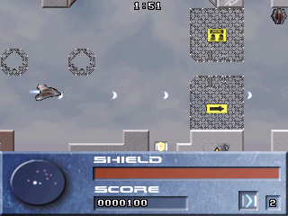
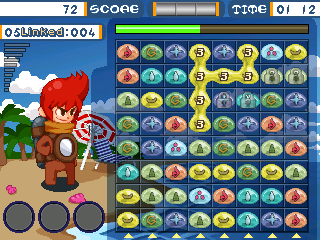

<div align="center">


**Play Game Park Holdings handheld games on your PC.**

[](https://github.com/zdiemer/magiceyes/releases/latest)
[](https://github.com/zdiemer/magiceyes/actions/workflows/ci.yml)
[](https://github.com/zdiemer/magiceyes/releases)
[](https://github.com/zdiemer/magiceyes-compat)
[](#download--run-windows)
[](LICENSE)

</div>

magiceyes runs games written for the **GP2X** (F100/F200), **GP2X Wiz**, and **GP2X
Caanoo** — including DRM-locked commercial titles — by emulating the device's ARM CPU and
reimplementing its video, audio, input, and DRM hardware. On Windows it's a single
self-contained `.exe`: no emulator setup, no virtual machine, no firmware flashing.

The name comes from the **MagicEyes** SoCs inside those handhelds (MMSP2 in the GP2X,
Pollux in the Wiz/Caanoo).

<table>
  <tr>
    <td align="center"><br><sub><b>Payback</b> — GP2X (commercial)</sub></td>
    <td align="center"><br><sub><b>Vektar</b> — GP2X</sub></td>
    <td align="center"><br><sub><b>Her Knights</b> — Wiz (commercial)</sub></td>
  </tr>
  <tr>
    <td align="center"><br><sub><b>Quartz 2</b> — GP2X</sub></td>
    <td align="center"><br><sub><b>Blazar</b> — GP2X</sub></td>
    <td align="center"><br><sub><b>Propis</b> — Caanoo</sub></td>
  </tr>
</table>

## Motivation

I'm a software developer with no experience in reverse engineering and an interest in
obscure gaming hardware. The GP2X, GP2X Wiz, and GP2X Caanoo are three systems that I
doubted would ever receive emulator coverage. I decided to try and proof-of-concept these
platforms almost entirely driven by AI coding tools.

This emulator is not intended to be robust, but it is intended to help preserve a very
obscure part of gaming history.

## Download & run (Windows)

1. Download the latest `magiceyes-<version>-win64.zip` from the
   [Releases page](https://github.com/zdiemer/magiceyes/releases) and unzip it.
2. Keep **`SDL2.dll` next to `magiceyes.exe`** (both are in the zip).
3. Launch a game one of two ways:
   - **Double-click `magiceyes.exe`** → an empty window opens → **File ▸ Open** and pick
     a game (a `.gpe` file, a game folder, or a `.zip`).
   - **From a terminal:** `magiceyes.exe <game.gpe | folder | game.zip>`

You supply the games yourself (see [Legal](#legal)). magiceyes accepts raw `.gpe`
binaries, GPEComp self-extracting `.gpe`, game folders, and `.zip` archives.

### Command-line options

```
magiceyes.exe [options] [game]
  -s, --scale N      integer window scale (default 3)
  -f, --fullscreen   start fullscreen
      --mute         start muted
      --volume N      audio volume 0–100
      --help          show all options
      --version       print version
```

### Controls

| Action       | Key                       |
|--------------|---------------------------|
| D-pad        | Arrow keys                |
| A / B / X / Y| Z / X / A / S             |
| Start        | Enter                     |
| Select       | Backspace or Right-Shift  |
| L / R        | Q / W                     |
| Fullscreen   | F11 (or Alt+Enter)        |
| **Screenshot** | **F12** (saved as PNG in `screenshots/`) |
| Quit         | Esc                       |

## Supported games

magiceyes is under active development; coverage grows as device features and games are
exercised. Per-game status lives in the
[**magiceyes-compat**](https://github.com/zdiemer/magiceyes-compat) tracker: one issue per game, with a
screenshot, a short clip, how it scored, and what stopped it if it failed.

As of the 25 August 2026 run of 972 games (all three handhelds), **739 are playable** and
794 put real gameplay on screen. Of the 126 that never render, 56 are not ARM binaries at all
or are incomplete dumps rather than emulator gaps. The full scoreboard is regenerated by
`tools/test/` (see `tools/test/CORPUS_SWEEP.md`); per-game status with screenshots lives at
[magiceyes-compat](https://github.com/zdiemer/magiceyes-compat).

## Known issues

- **Hot-loading games can crash on Windows.** Opening a second or third *different* game
  in one session, after a memory-heavy title (e.g. Vektar or Knight Lore), can crash the
  app. Workaround: relaunch magiceyes between heavy games. (Single loads are fine.)
- **Imperfect emulation.** Some titles render or run only partially, or rely on assets
  that aren't present (e.g. Knight Lore's MIDI needs `timidity.cfg`; some dynamic titles
  draw incompletely). Audio can stutter under WSL/WSLg specifically — that's a known
  Microsoft WSLg audio-sink bug, not magiceyes; the native Windows build is unaffected.

## Planned

- **Firmware support** — bundle or auto-stage a device root filesystem so dynamically
  linked GP2X *and* Wiz titles run on the native build without manual setup.
- **Broader SDL / syscall coverage** — more device features and emulated syscalls so more
  titles run unmodified.
- **macOS and Linux release binaries** — native builds for all three desktop platforms
  alongside Windows.

## Build from source / developer notes

magiceyes has two halves: an OS-agnostic **guest** side (ARM artifacts that run *inside*
the emulator) and a per-platform **host** side (the CPU engine + the SDL2 viewer).

- **Native Windows build** (the released `.exe`): cross-compiled from WSL/Linux with
  MinGW-w64. See [`host/win/README.md`](host/win/README.md). In short:
  `host/win/build_fork_win.sh` (the forked Unicorn CPU core) → `host/win/get_sdl2.sh` →
  `host/win/build_bundle_win.sh` → `bin/magiceyes.exe`. `host/win/build_release.sh`
  reproduces the whole chain and packages a release zip.
- **Linux / WSL build**: the same engine, built native, plus a standalone SDL2 viewer.
  `host/engine/build_engine.sh` → `bin/me_unicorn`, `host/build_viewer.sh` → `bin/viewer`,
  then `./magiceyes.sh <game>` runs the pair. `guest/build_guest.sh` builds the ARM guest
  libraries with the GPH SDK toolchain (needed only for EABI titles).

The full architecture, the device hardware contract, and every hard-won gotcha live in
[`CLAUDE.md`](CLAUDE.md); the roadmap is in [`TODOS.md`](TODOS.md).

## Legal

magiceyes is a clean-room reimplementation of the GP2X/Wiz/Caanoo SDL, DRM, and device
hardware surface, written for **interoperability and game preservation**. It is **not** a
piracy tool and a release contains **no firmware and no game data**:

- **No device firmware** (glibc, the real SDL stack, the genuine DRM libraries) is
  included — supply it yourself from a device or firmware image you own.
- **No games** are included — supply your own, legally obtained, dumped from hardware or
  media you own.

magiceyes' own code is free software under the **GNU GPL v2** (see [`LICENSE`](LICENSE)).
The complete corresponding source is at <https://github.com/zdiemer/magiceyes>. It
statically links a fork of the [Unicorn](https://www.unicorn-engine.org/) CPU emulator
(qemu's TCG core); SDL2 is under the zlib license.
